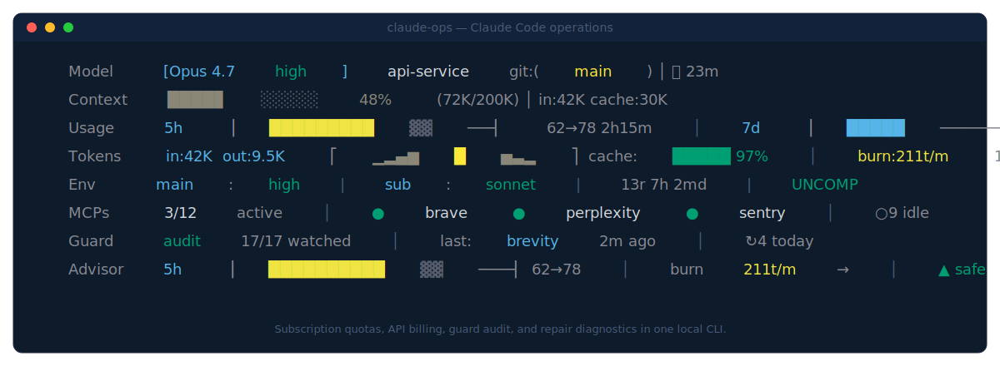

<p align="center">
  
</p>

<h1 align="center">setpoint</h1>

<p align="center"><em>Holds your Claude Code configuration at the values it was meant to have.</em></p>

<p align="center">
  <a href="https://github.com/AmeerJ97/setpoint/actions/workflows/test.yml"></a>
  
  
  
  <a href="LICENSE"></a>
</p>

---

Claude Code pushes effort level, thinking budget, tool-output limits, and compaction thresholds through GrowthBook and periodically reverts them to server-side defaults. `setpoint` watches those values with inotify, re-applies them in under 500 ms, and surfaces the whole control system — consumption, guard state, anomalies, recommendations — as an always-on terminal HUD.

A *setpoint* is the target value a controller maintains against disturbance. That's what this does.

## Install

```bash
npm install -g setpoint
```

Add to `~/.claude/settings.json`:

```json
{ "statusLine": { "type": "command", "command": "setpoint" } }
```

Restart Claude Code. The HUD appears above the input area.

Optional background services (systemd user units, from a source checkout):

```bash
bash scripts/install-analytics.sh     # per-session cache + history
bash scripts/install-health-timer.sh  # daily bloat / drift scan
bash scripts/install-guard.sh         # inotify GrowthBook watcher
systemctl --user start claude-quality-guard
```

## CLI

```
setpoint                         render HUD (stdin JSON → 8 lines to stdout)
setpoint guard status [--json]   drilldown of the 17-category enforcement surface
setpoint demo                    render the HUD in every color / glyph mode
setpoint health                  run the health auditor once
setpoint advisor                 run the daily advisor once
```

`setpoint guard status` prints a three-column table showing, per category, whether it is `held` / `drift` / `skipped`, the last time the guard touched it, and the expected-vs-actual value of every flag under it. `--json` emits the same schema for monitoring pipelines. The command exits non-zero when any category has drifted.

## The 17-category guard

| Category | Flag | Target |
|---|---|---|
| brevity | `tengu_swann_brevity` | `""` |
| quiet | `tengu_sotto_voce`, `quiet_fern`, `quiet_hollow` | `false` |
| summarize | `tengu_summarize_tool_results` | `false` |
| maxtokens | `tengu_amber_wren.maxTokens` | `128000` |
| truncation | `tengu_pewter_kestrel.global` | `500000` |
| refresh_ttl | `tengu_willow_refresh_ttl_hours` | `8760` |
| mcp_connect | `tengu_claudeai_mcp_connectors` | `false` |
| bridge | `bridge.enabled` | `false` |
| grey_step | `tengu_grey_step` | `false` |
| grey_step2 | `tengu_grey_step2.enabled` | `false` |
| grey_wool | `tengu_grey_wool` | `false` |
| thinking | `tengu_crystal_beam.budgetTokens` | `128000` |
| willow_mode | `tengu_willow_mode` | `""` |
| compact_max | `tengu_sm_compact_config.maxTokens` | `200000` |
| compact_init | `tengu_sm_config.minimumMessageTokensToInit` | `500000` |
| tool_persist | `tengu_tool_result_persistence` | `true` |
| chomp | `tengu_chomp_inflection` | `true` |

Categories can be individually skipped without disabling the whole guard:

```bash
src/guard/claude-quality-guard.sh skip compact_max    # leave compaction alone
src/guard/claude-quality-guard.sh unskip compact_max  # re-enable
src/guard/claude-quality-guard.sh reset               # clear all skips
src/guard/claude-quality-guard.sh status              # current state
```

Background on why the guard exists:
[anthropics/claude-code#41477](https://github.com/anthropics/claude-code/issues/41477),
[#42796](https://github.com/anthropics/claude-code/issues/42796),
[#28941](https://github.com/anthropics/claude-code/issues/28941).

## Anomaly detection

Eleven rules run inline with every render cycle. Critical alerts override the advisor line; all alerts append to `~/.claude/plugins/claude-hud/anomaly-log.jsonl`.

| Alert | Trigger | Severity |
|---|---|---|
| Token spike | >50K output in a single turn | warn |
| Runaway agent | Agent-spawn count exceeds threshold | critical |
| Context thrashing | Compaction fires >N times per session | warn |
| Stale session | >4 hours without compaction or `/clear` | warn |
| GrowthBook escalation | Guard activations >20/hour | warn |
| Background drain | Cowork / CCD / chrome-native-host / Desktop agents | critical/warn |
| Context pressure | >85% used, no compaction | warn |
| MCP failure streak | Same MCP fails 3+ times consecutively | warn |
| Read:Edit ratio | `reads < 1.0 × edits` on Opus sessions | warn |
| Session efficiency | Low output-to-consumed ratio | info |
| Tool diversity | Session stuck on one tool class | info |

## Color and glyph policy

| Env | Effect |
|---|---|
| `SETPOINT_PALETTE=rag` *(default)* | Vivid green / yellow / red discrete state colors |
| `SETPOINT_PALETTE=cividis` | Colorblind-safe blue→teal→yellow (muted) |
| `SETPOINT_NERD=1` | Nerd Font glyphs |
| `SETPOINT_PLAIN=1` | ASCII only (CI, ssh without fonts) |
| `NO_COLOR=1` / `FORCE_COLOR=0` | Honoured per no-color.org / npm conventions |

Terminal capability is auto-detected (truecolor / ansi256 / ansi16 / none) with graceful degrade. Run `setpoint demo` to see every mode back-to-back in your terminal.

## Multi-session correctness

Every per-session cache file, history entry, debounce marker, and RTK snapshot is keyed by `session_id`. Running three Claude Code sessions in parallel gives three independent HUDs, each showing only its own burn rate, tokens, cache hit, and duration. The Env line surfaces `⧉N sessions` when the account's rate-limit quota is being shared.

## Architecture

```
Claude Code ──stdin JSON──→  setpoint (one-shot)  ──→  8 lines to stdout
                                    │ reads
                                    ▼
                            ~/.claude/plugins/claude-hud/
                                    ▲
  ~/.claude.json ──inotify──→ quality guard (bash+python, sub-500ms)
                                    │ logs → /tmp/claude-quality-guard.log
                                    ▼
                            analytics daemon (60s poll) · health timer (daily)
```

The HUD renderer is a one-shot command. Background services run independently as systemd user units and communicate only through files.

## Data sources

| Source | Read by |
|---|---|
| stdin JSON | Renderer |
| `~/.claude/settings.json` | Renderer |
| `~/.claude.json` (GrowthBook cache) | Renderer, Guard |
| Session JSONLs | Analytics daemon |
| `~/.claude/plugins/claude-hud/token-stats/<sid>.json` | Renderer |
| `~/.claude/plugins/claude-hud/usage-history.jsonl` | Rate projector |
| `/tmp/claude-quality-guard.log` | Renderer + `guard status` |

## Related tools

| Project | Overlap |
|---|---|
| [ryoppippi/ccusage](https://github.com/ryoppippi/ccusage) | Complementary. Retrospective JSONL analyzer; run both. |
| [sirmalloc/ccstatusline](https://github.com/sirmalloc/ccstatusline) | Display-only statusLine with powerline themes. |
| [Maciek-roboblog/Claude-Code-Usage-Monitor](https://github.com/Maciek-roboblog/Claude-Code-Usage-Monitor) | External burn-rate monitor in its own window. |
| [Haleclipse/CCometixLine](https://github.com/Haleclipse/CCometixLine) | Rust statusLine. |

`setpoint`'s differentiator is the inotify feedback loop — it actively re-applies reverted `tengu_*` overrides in real time.

## Requirements

- Node.js ≥ 18 (ESM, `Intl.Segmenter`)
- Linux with systemd (for background services)
- `inotifywait` (`inotify-tools` package) for the quality guard

## Testing

```bash
npm test        # 249 tests, Node's built-in test runner, zero deps
npm run health  # run the health auditor once
npm run advisor # run the daily advisor once
```

Smoke test:

```bash
echo '{"session_id":"dev","model":{"id":"claude-opus-4-7"},"context_window":{"context_window_size":200000,"used_percentage":48,"current_usage":{"input_tokens":42000,"output_tokens":9500}},"rate_limits":{"five_hour":{"used_percentage":62},"seven_day":{"used_percentage":38}}}' | setpoint
```

## License

[MIT](LICENSE)
